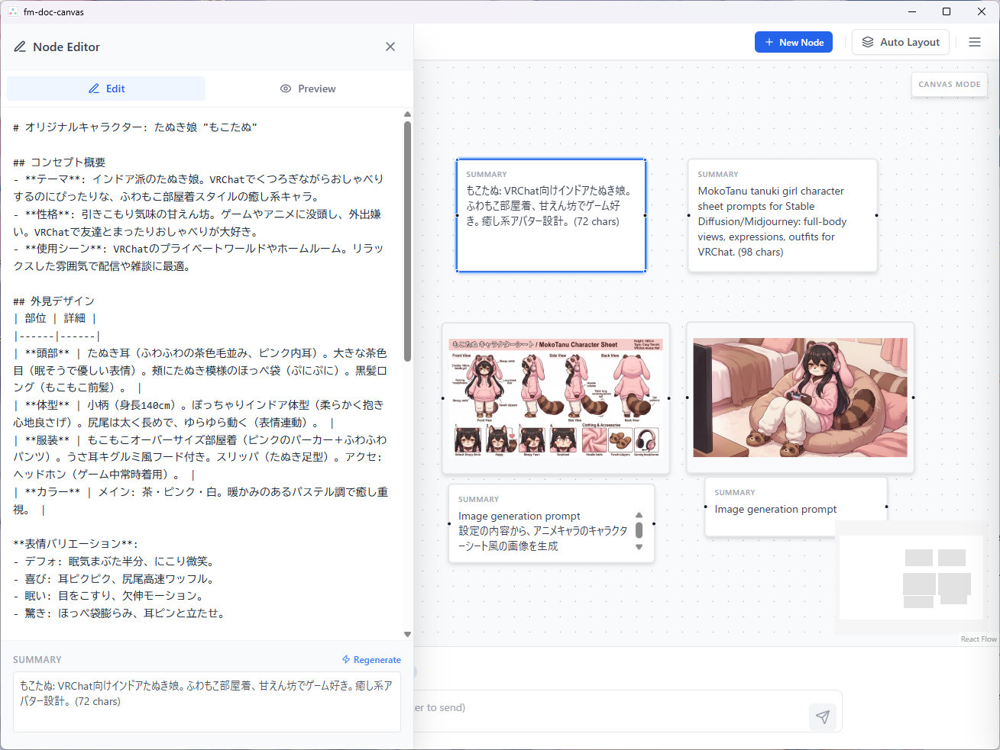

# fm-doc-canvas

`fm-doc-canvas` は、無限キャンバス上にテキストノードを配置・連結し、LLM（大規模言語モデル）を活用して思考の整理や拡張を行うことができる AI メモツールです。

LLM ＆ 画像生成には API キーが必要で、OpenRouter の使用を前提としています。(OpenAI API 互換なら他も利用できます)



## 主な機能

- **フリーキャンバス・エディタ**: ノード形式でテキストを配置し、ラインで自由に接続して情報の流れを可視化。
- **Markdown 対応**: 各ノードは Markdown 形式で記述可能。専用のドロワエディタで詳細な編集とプレビューが行えます。
- **LLM 連携**:
  - OpenAI 互換 API (OpenRouter, Ollama 等) をサポート。
  - 選択したノードをコンテキストとして LLM に指示を出し、結果を新しいノードとして生成。
  - 接続されたノードの順序を考慮したインテリジェントなコンテキスト生成。
  - 本文からの自動サマリー（要約）生成機能。
- **マルチモーダル対応**: 画像生成（OpenRouter）や画像解析、ファイルのドラッグ＆ドロップによるインポート。
- **エクスポート機能**: 個別ファイルの書き出しや、Marp 形式によるスライド一括エクスポート。

### 主な使い方

- LLM への質問と回答を、付箋（ノード）としてキャンバスへ貼り付けて蓄積していくのが基本的な使い方です。
  - プロトタイプとして画像を生成し、それを眺めながらさらに思考を深めることができます。
- 単発の調査だけでなく、キャンバス上のテキストを選択して質問することで、その内容を前提とした指示が可能です。
  - 回答の続きを生成させる。
  - テキストノードの内容を要約・分析させる。
  - テキストノードの内容を元に画像を生成させる。
- 既存ノードを活用した指示は、画像生成でも利用可能です。
  - 画像を指定しながら指示を出すことで、簡易的な画像編集ツールとしても活用できます。

## 技術スタック

- **Framework**: [Wails v2](https://wails.io/) (Go + React)
- **Frontend**: React, Zustand, Tailwind CSS
- **Backend**: Go
- **Toolchain**: [mise](https://mise.jdx.dev/)

## 開発環境のセットアップ

このプロジェクトでは、ツールチェーンの一貫性を保つために `mise` を使用しています。

### 1. 前提条件

以下のツールを事前にインストールしてください。
- [mise-en-place](https://mise.jdx.dev/getting-started.html)

### 2. ツールのインストール

プロジェクトのルートディレクトリで以下のコマンドを実行し、必要なバージョン（Go, Node.js, Wails CLI）を導入します。

```bash
# ツールチェーンのインストール
mise install

# Wails CLI のセットアップ
mise run setup
```

### 3. 開発モードでの実行

```bash
mise run dev
```

### 4. ビルド

```bash
mise run build
```

## 使い方

1. **ノードの追加**: 画面上の追加ボタンから新しいテキストボックスを作成します。
2. **接続とコンテキスト・トラバース**:
    - **方向性のある接続**: ノードの右端（Source）から別のノードの左端（Target）へドラッグすることでラインを引けます。情報は「左から右へ」流れる方向性を持ちます。
    - **コンテキストの自動追跡**: ノードが接続されている場合、あるノードを選択して AI プロンプトを実行すると、そのノードから上流（左側）に辿れる一連のノードが自動的にコンテキスト（前提知識）として LLM に送信されます。これにより、1 つのノードを選択するだけで、文脈を維持したまま対話を継続できます。
    - **ループ防止**: 循環参照が発生するような接続は自動的にエラーとなり、作成が制限されます。
3. **編集**: ノードをクリックすると左側に編集ドロワが開きます。
4. **AI プロンプト**: 画面下の入力欄にプロンプトを入力します。「テキストノード生成プロンプトモード」と「画像ノード生成プロンプトモード」があり、切り替えて使用できます。
    - ノードを選択した状態で実行すると、その内容がコンテキストとして送信されます。
5. **インポート**: ファイルをキャンバスにドラッグアンドドロップすることでノードとしてインポートできます。
    - テキストファイル: .txt, .md
    - 画像ファイル: .png, .jpg, .jpeg, .webp
6. **エクスポート**:
    - **個別エクスポート**: ノードを右クリックし、コンテキストメニューから「エクスポート」を選択することで、テキスト（.md）や画像（.png等）を個別に保存できます。
    - **スライドエクスポート**: 複数のノードを選択した状態で一括出力を行うと、Marp 形式の Markdown ファイルとしてスライド構成でエクスポートされます。(将来的機能の仮実装となります)


### 設定

アプリを最大限に活用するために、設定画面から以下の項目を構成してください。

#### LLM (テキスト生成) 設定
OpenAI 互換 API を提供する任意のプロバイダー（OpenRouter, Ollama, LocalAI 等）を利用可能です。
- **Base URL**: API エンドポイントを指定します（例: `https://openrouter.ai/api/v1` や `http://localhost:11434/v1`）。
- **API Key**: プロバイダーから発行された API キーを入力します。
- **Model Name**: 使用するモデル名（例: `openai/gpt-5`, `x-ai/grok-4.1-fast` 等）を指定します。
  - 画像入力対応の vision モデルだと画像ノードを渡しての質問ができるのでオススメです。

#### 画像生成設定
テキスト生成とは別に、画像生成用のモデル設定を行えます。
- **プロバイダー**: 現在は OpenRouter を介した画像生成を想定しています。LLM と同じく各種設定をしてください。
  - nano banana 等との画像入力編集に強いモデルを使うと画像加工もできてオススメです。
- **画像保存先**: 生成された画像やインポートされた画像が保存されるディレクトリを指定します（デフォルト: アプリ実行ディレクトリの `Image/`）。
  - 生成された画像はこのディレクトリ内に蓄積されていきます。

#### メンテナンス
- **キャンバス初期化**: すべてのノードと接続を削除し、キャンバスを初期状態にリセットします。

### データの保存と関連ファイル

- **設定ファイル (`config.json`)**:
  -設定ファイルは config dir の opencode-gui-client/config.json に保存されます
    -  Windows の場合 %USERPROFILE%\AppData\Roaming\opencode-gui-client\config.json
    -  macOS の場合 ~/Library/Application Support/opencode-gui-client/config.json
    -  Linux の場合 ~/.config/opencode-gui-client/config.json
 
  - **注意**: API キーがプレーンテキストで保存されるため、このファイルを不用意に公開したり、共有したりしないようご注意ください。

- **画像ストレージ**:
  - 設定の「画像保存先」で指定したフォルダに、生成された画像が保存されます。
  - 生成を繰り返すと画像が蓄積されていくため、必要に応じて手動で整理してください。
- **キャンバスデータ**:
  - キャンバス上のノード配置やテキスト内容は、ユーザーが明示的に保存した任意の `.json` ファイルに記録されます。
  - save で保存せずにアプリを終了すると編集途中のデータは失われます。

## プロジェクト構造

- `backend/`: Go によるアプリケーションロジックと API 連携
- `frontend/`: React + Tailwind CSS による UI 実装
- `docs/`: 要件定義・詳細仕様ドキュメント
- `build/`: アプリケーションのアイコンやインストーラーの設定


## 開発ルール (`AGENTS.md`)

開発時には以下のルールを遵守してください：
- `go`, `npm`, `wails` などのコマンドは直接実行せず、必ず `mise x -- <command>` (または `mise run <task>`) を経由して実行してください。

## ライセンス

[LICENSE](./LICENSE) ファイルを参照してください。

## 更新履歴

- v0.3.5: 画像生成プロバイダを OpenRouter/OpenAI/Gemini の 3つに拡張、複数ノード選択時のコンテキスト構築失敗を修正
- v0.3.0: first release

---
Created by [rerofumi](mailto:rero2@yuumu.org)
